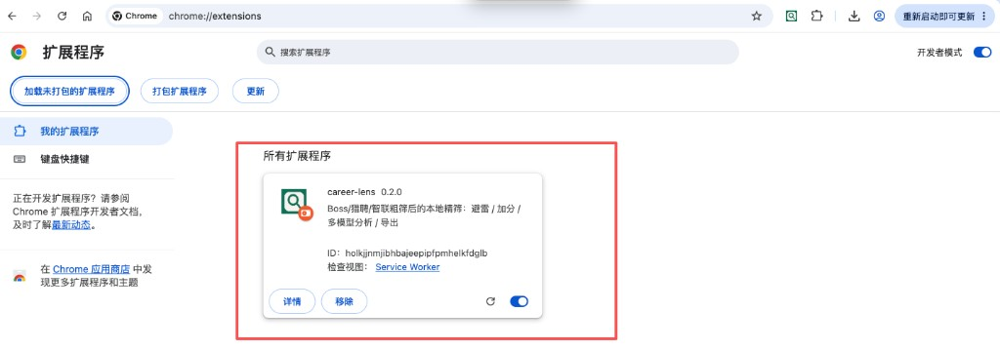
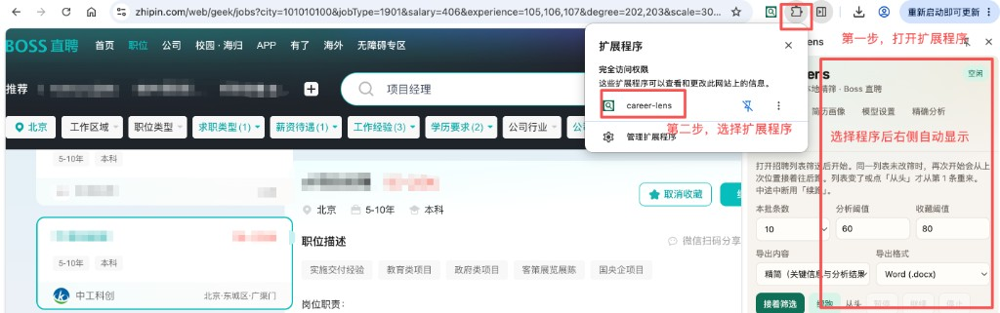

# career-lens · 岗位分析助手

招聘网站能帮你筛城市和薪资，但筛完之后，真正费神的是：

- 这个岗到底适不适合我？  
- 有没有隐形坑（销售属性、驻场、硬门槛年限）？  
- 匹配度看起来不错，行业跨度会不会踩坑？  
- 今晚到底该打开哪几个链接投，简历该往哪改？  

**career-lens 不是再做一层「关键词过滤」。**  
它在你已经粗筛好的 Boss / 猎聘 / 智联列表上，用你的简历画像做第二道研判：该排除的排除，该谨慎的标清楚，值得投的说清为什么、缺口在哪——最后给你一份能直接行动的清单和导出报告。

**不会自动投递、不会自动打招呼。** 点开岗位、投递简历，仍由你自己决定，降低个人账号风险。

---

> [!CAUTION]
> ## 使用须知与风险
>
> **安装、加载或点击「开始精筛」前请完整阅读。继续使用即视为同意。侧栏弹窗与本文表述不一致时，以较严格者为准。**
>
> ### 一、用途与边界
>
> 本工具是浏览器端**个人求职决策辅助**扩展，不是招聘平台官方产品，也不是数据采集套件。
>
> - **仅供**自然人个人求职研判；严禁批量采集、转售岗位数据，或用于商业爬取、竞品情报、账号养号等。
> - **不会**自动投递、自动打招呼；**不协助**绕过验证码、短信验证或「账号行为异常」等安全机制。
> - 你须遵守 Boss / 猎聘 / 智联等第三方用户协议与适用法律。
>
> ### 二、你须自行承担的风险
>
> | 风险类型 | 说明 |
> |----------|------|
> | 账号与平台处置 | 验证、限流、封号等后果由使用者自负，与作者无关 |
> | 判断误差 | 规则与模型结果仅供参考，不构成录用承诺或法律意见；投递与否须本人确认 |
> | 隐私与第三方 API | 无自建后端，数据默认在本地；开启 AI 时摘要发往你所选模型厂商，受其条款约束 |
> | 合规 | 违反平台协议或适用法律的风险由使用者自行评估与承担 |
>
> ### 三、免责与保护性限额
>
> 在适用法律允许的最大范围内：本工具按「现状」提供；作者不对账号损失、机会损失、因你方 Key/环境导致的数据问题，或第三方平台/模型中断承担责任。
>
> 扩展内日风控次数、开详情上限等限制用于降低账号风险；请勿通过清数据或重装故意规避。侧栏首次精筛前须勾选同意本须知。
>
> ### 四、使用本工具即表示
>
> 你具备完全民事行为能力（或已获监护人同意）；你确认上述条款。若不同意，请立即停止使用并卸载本扩展。

> [!WARNING]
> ## 使用注意
>
> - 保持招聘列表页可见；验证码请在网站上完成；网络异常可刷新后等待自动继续（手动暂停除外）
> - 标题明显跨域（芯片/电力/医院等）或列表避雷会**跳过开详情**并直接排除/标记
> - Boss 详情「数据加载失败」/页脚噪声不会当正式 JD 建议投递
> - 已配置 API Key 时：模型失败或规则虚高 → **待复核**，不直接「建议投递」
> - 猎聘：建议本批≤5；后台开详情后关闭；今日风控≥3 或开详情达上限将暂停至明天
> - 每开详情约 5 条会短休息，约 8–12 条会模拟滚动停顿；风控后须手动继续并冷却
> - 扫描版 PDF 可能抽不出文字；猎聘 / 智联请在搜索列表页使用

---

## 它解决什么问题

| 痛点 | career-lens 怎么帮 |
|------|-------------------|
| 每天几十上百条 JD，肉眼对简历又慢又容易漏 | 按画像算匹配度，并标出年限 / 必备证书等硬门槛缺口 |
| 不想加班、出差或驻场？有特别关心的技术？ | 自定义避雷项（排除）与注意（只提醒）分开，默认不乱勾避雷 |
| 只看分数不够，仍要判断值不值得投 | AI 做岗位成分、亮点、缺口、是否建议投递、改简历侧重点 |
| 看完就忘，晚上不知道先开哪个 | 「建议 / 待复核 / 谨慎 / 已排除」+ 投递列表集中打开与导出 |
| 好岗容易刷过去找不到 | 达标且未避雷可自动收藏（已收藏不会取消） |
| 列表外的 JD / 误拦复核 | 「精确分析」粘贴正文，走同一套研判 |
| 同一列表跑一半中断后，又从第一条重来 | 「接着筛选」跳过已分析；中断可「续跑」 |

---

## 一次典型使用场景

你在 Boss 上已经筛好「北京 · 项目经理 · 薪资区间」。  
打开侧边栏，用简历填好画像（或上传 PDF 预填）。在 **开始执行** 页设好条数与阈值后点「开始精筛」，扩展会缓慢打开列表里的岗位：

1. **硬门槛门禁**：必须证书 / 工作语言 / 年限 / 硬性领域等先判 PASS/FAIL；未通过标「硬门槛未过」，展示分封顶，不得建议投递、不自动收藏。  
2. **契合四维与待复核**：角色/领域/能力/资质（有 Key 时语义或向量相关性；无 Key 规则兜底）；高契合被门禁压住时进 **待复核**，仍可 AI、可进投递列表，但不自动收藏。  
3. **简历侧写**：规则侧写 + 可选「生成 AI 侧写」；列出当前职业包适合分析的岗位类型。  
4. **AI 解读**（需 Key）：按契合原分过分析阈值；不改分、不改门禁。  
5. **收藏与投递列表**：仅建议投递且达收藏阈值才自动收藏；投递列表按契合原分入库，可 **导出 Excel（xlsx）**；本批结果另可导出 Markdown / Word。  

同一筛选列表没变时，按钮会变成「接着筛选」，从上次位置往后跑。  
遇到猎聘私信 JD、朋友转发的岗位描述，或怀疑被误拦时，到 **精确分析** 粘贴正文，单独跑同一套规则 + AI。

---

## 安装（约 2 分钟）

1. 使用 Chrome 或 Edge  
2. 地址栏打开 `chrome://extensions` 或 `edge://extensions`  
3. 打开 **开发者模式**  
4. **加载已解压的扩展程序** → 选择本仓库里的 **`extension`** 文件夹  
5. 工具栏出现 career-lens 图标即可  

1. 添加扩展程序  

2. 添加成功显示  

3. 如何使用  

内容更新后：扩展页点 **重新加载** 或重新添加程序，并刷新招聘网站页面。

---

## 界面说明：配置 · 显示 · 操作

按侧栏 Tab 顺序说明（名称以界面为准）。

### 1. 简历画像

**配置**

| 项 | 作用 |
|----|------|
| 简历上传 / 正文 | PDF、Word、TXT 或粘贴；扫描件可能抽不出字 |
| 从文本提取标签 | 预填年限、技能、行业、方向、证书、语言，提取后请核对 |
| 工作年限 | 必填，0–50 的整数；未填不能保存画像或开始精筛 |
| 契合四维权重 | 角色 / 领域 / 能力 / 资质；修改后须点「确认权重」，合计必须为 100 才生效 |
| 避雷项 | 列表标题/摘要命中则**跳过开详情**并标已排除，不调模型；默认不勾选，可自定义 |
| 注意项 | 只提醒关注，不影响打分与分析 |

**操作**

- **确认权重**：四维合计须为 100，否则恢复上次已确认值且不生效。  
- 底部 **保存画像** 吸底固定；不负责写入权重。  

### 2. 模型设置

**配置**

| 项 | 作用 |
|----|------|
| 模型单选 | DeepSeek / 通义千问 / 腾讯混元 / OpenAI / Gemini，同时只用一家 |
| 对应 API Key | 填入所选模型的 Key；无 Key 仍可打分与避雷，无 AI 解读 |

**操作**

- 底部 **保存模型设置** 吸底固定。  

### 3. 开始执行

**配置**

| 项 | 作用 |
|----|------|
| 本批条数 | 本轮最多分析多少条（默认 5，最大 100；猎聘建议≤5，连开详情过快会触发「账号行为异常」短信验证） |
| 分析阈值 | **契合原分** ≥ 该值且未避雷才调 AI（待复核岗也按原分） |
| 收藏阈值 | 展示分 ≥ 该值、门禁通过且为「建议投递」才尝试自动收藏 |
| 导出内容 | 精简（岗位关键信息 + 分析） / 详细（更全字段 + 分析结果；不含位置、招聘者等） |
| 导出格式 | Markdown 或 Word |

**显示**

| 区域 | 内容 |
|------|------|
| 平台标签 | 顶栏显示当前识别的 Boss / 猎聘 / 智联 |
| 进度 / 模型统计 | 本批进度；模型调用次数与费用粗估 |
| 日志 | 打开详情、跳过、暂停、报错等过程 |
| 本批结果 | 按「建议投递 → 待复核 → 谨慎投递 → 已排除」分组；空分组不显示 |

每条结果大致为：岗位 · 公司；匹配度 / 硬门槛未过 · 建议文案 · 耗时；「打开」链接；缺口 / 注意摘要。

**操作（含悬停）**

| 操作 | 说明 |
|------|------|
| 开始精筛 / 接着筛选 | 首次从第 1 条；同列表未改筛则从上次位置继续 |
| 续跑 | 本批中途暂停后的断点恢复 |
| 从头 | 清空列表游标，下次从第 1 条 |
| 暂停 / 继续 / 停止 | 手动暂停需点「继续」；切页 / 验证码 / 网络异常会弹窗，约每 10 秒自动检测恢复 |
| 导出 | 按当前导出内容与格式下载本批结果 |
| 结果里「打开」 | 新标签打开岗位页 |

### 4. 精确分析

**配置 / 输入**

| 项 | 作用 |
|----|------|
| 岗位名称 | 必填 |
| 公司名称 | 可选 |
| 岗位链接 | 可选；有链接时可从投递列表点开 |
| 岗位正文 | 粘贴职位描述与任职要求 |

**显示**

- 下方输出匹配度、建议、硬门槛缺口、分项分、AI 全文等。

**操作**

- 点 **精确分析**：走与列表相同的规则 +（条件满足时）模型分析。  
- 达标且未排除会写入投递列表，来源标记为「精确」。

### 5. 投递列表

**配置**

| 项 | 作用 |
|----|------|
| 入库阈值 | **契合原分** ≥ 该值且未排除才进入列表（待复核/门禁失败但高契合也可入）；可 **保存阈值** |

**显示**

| 列 | 说明 |
|----|------|
| 岗位 | 前 6 字，悬停全称，点击打开链接 |
| 公司 | 前 8 字，悬停全称 |
| 建议·匹配 | 建议分组 + 展示匹配度/契合原分（如 `建议 85/90`）；点击查看分析 |
| 来源 | BOSS / 猎聘 / 智联 / 精确 |

最多保留 100 条；每页 30 条。表头滚动时保持可见。

**操作（含悬停）**

| 操作 | 说明 |
|------|------|
| 悬停岗位 / 公司 | 显示全名 |
| 点击岗位名 | 打开岗位链接 |
| 点击「建议·匹配」 | 弹出该岗分析结果 |
| 全选本页 / 打开选中 / 删除选中 | 批量打开或清理 |
| **导出 Excel** | 导出全部投递列表为 xlsx（冻结表头、列宽自适应；按匹配度→契合原分→入列时间倒序） |
| 翻页 | 上一页 / 下一页 |

---

## 常见问题

**为什么显示「硬门槛未过」、分数只有三十多？**  
门禁失败（如缺建造师、英语工作语言未填）。旁注的契合原分可能仍较高，但展示分会封顶；不会「建议投递」、也不会自动收藏。若契合原分较高（约 ≥60），会进 **待复核**，避免好岗被漏掉。

**什么是「待复核」？**  
两类常见原因：① 防漏——高契合被门禁压住，或展示分偏低但能力仍贴；② 状态不可信——已配模型但分析失败/空响应，或语义失败只剩规则虚高分。请人工看一眼；可进投递列表，但不自动收藏。

**匹配度很高（甚至四维全 100）为什么仍是「待复核」？**  
若模型未成功返回分析（忙线、网络、空内容等），或详情未真正加载，规则分不可信，不会按满分「建议投递」。等模型恢复后可重跑该条或人工判断。

**匹配度不低为什么仍是「谨慎投递」？**  
硬门槛有缺口且未达待复核门槛，或 AI 综合判断为谨慎 / 不建议。分数和「值不值得投」不是同一件事。

**暂停后为什么有时会自己继续、有时要我点「继续」？**  
切页、验证码、网络/详情加载异常属于系统暂停，约每 10 秒自动探测恢复。你点的「暂停」是手动暂停，必须再点「继续运行」。

**工作年限和标签提取一定准吗？**  
不一定。能从「8 年工作经验」等句子或经历年份粗估，提取后请人工确认。

**自动收藏会取消已有收藏吗？**  
不会。只会在达标时尝试收藏，已收藏则跳过。

**数据会上传到你们服务器吗？**  
没有自建后端。画像和结果存在浏览器本地；只有开启 AI 分析时，才会把岗位与画像摘要发到你所选模型的官方接口。

**出现 `kQuotaBytes quota exceeded`？**  
扩展本地存储写满了。重新加载扩展后一般可继续；仍报错时点侧栏「从头」，或到扩展管理页清除本扩展数据。

---

## 文档

| 文件 | 内容 |
|------|------|
| [docs/SPEC.md](docs/SPEC.md) | 产品说明书（门禁、四维、待复核、推荐可信度、验收） |
| [docs/TECH.md](docs/TECH.md) | 代码结构、打分流、暂停恢复、失败详情、微调入口 |
| [docs/CHANGELOG.md](docs/CHANGELOG.md) | **本轮已增加内容 + 后续优化方向** |

---

## License

MIT
