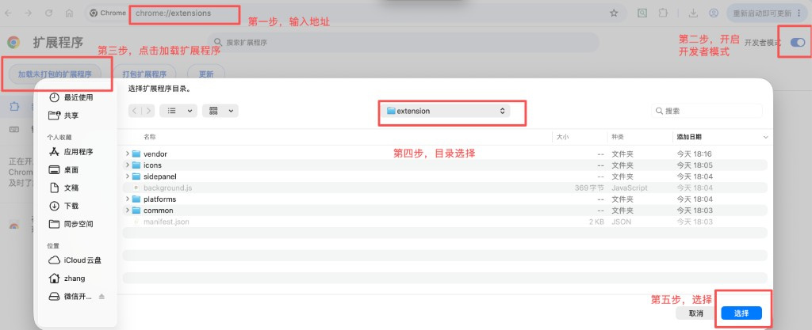

# career-lens · 岗位分析助手

招聘网站能帮你筛城市和薪资，但筛完之后，真正费神的是：

- 这个岗到底适不适合我？  
- 有没有隐形坑（销售属性、驻场、硬门槛年限）？  
- 匹配度看起来不错，行业跨度会不会踩坑？  
- 今晚到底该打开哪几个链接投，简历该往哪改？  

**career-lens 不是再做一层「关键词过滤」。**  
它在你已经粗筛好的 Boss / 猎聘 / 智联列表上，用你的简历画像做第二道研判：该排除的排除，该谨慎的标清楚，值得投的说清为什么、缺口在哪——最后给你一份能直接行动的清单和导出报告。

**不会自动投递、不会自动打招呼。** 点开岗位、投递简历，仍由你自己决定，降低个人账号风险。

---

## 它解决什么问题

| 痛点 | career-lens 怎么帮 |
|------|-------------------|
| 每天几十上百条 JD，肉眼对简历又慢又容易漏 | 按画像算匹配度，并标出年限 / 必备证书等硬门槛缺口 |
| 不想加班、出差或驻场？有特别关心的技术？ | 自定义避雷项（排除）与注意（只提醒）分开，默认不乱勾避雷 |
| 只看分数不够，仍要判断值不值得投 | AI 做岗位成分、亮点、缺口、是否建议投递、改简历侧重点 |
| 看完就忘，晚上不知道先开哪个 | 「建议投递 / 谨慎投递 / 已排除」+ 投递列表集中打开 |
| 好岗容易刷过去找不到 | 达标且未避雷可自动收藏（已收藏不会取消） |
| 列表外的 JD / 误拦复核 | 「精确分析」粘贴正文，走同一套研判 |
| 同一列表跑一半中断后，又从第一条重来 | 「接着筛选」跳过已分析；中断可「续跑」 |

---

## 一次典型使用场景

你在 Boss 上已经筛好「北京 · 项目经理 · 薪资区间」。  
打开侧边栏，用简历填好画像（或上传 PDF 预填）。在 **开始执行** 页设好条数与阈值后点「开始精筛」，扩展会缓慢打开列表里的岗位：

1. **规则先判**：按技能 / 行业 / 方向 / 证书 / 语言加权算匹配度；注意项提醒关注点；避雷命中则不再做 AI 分析；只有分数达标且未避雷，才会调用模型。  
2. **硬门槛核对**：例如岗位写「8 年以上」或「必须 PMP」，与画像对比，缺口单独列出。  
3. **AI 再读一遍**（需自备 Key）：不重新打分，而是全局分析目标岗契合度、风险在哪、修改建议等。  
4. **收藏顺手攒着**：达到收藏阈值且未排除的岗位，会尝试自动收藏，方便回站里翻。  
5. **收成可行动结果**：侧栏与 Word / Markdown 导出按建议分组；达标的进投递列表，晚上集中打开链接去投。  

同一筛选列表没变时，按钮会变成「接着筛选」，从上次位置往后跑。  
遇到猎聘私信 JD、朋友转发的岗位描述，或怀疑被误拦时，到 **精确分析** 粘贴正文，单独跑同一套规则 + AI。

---

## 安装（约 2 分钟）

1. 使用 Chrome 或 Edge  
2. 地址栏打开 `chrome://extensions` 或 `edge://extensions`  
3. 打开 **开发者模式**  
4. **加载已解压的扩展程序** → 选择本仓库里的 **`extension`** 文件夹  
5. 工具栏出现 career-lens 图标即可  

**
1、添加扩展程序
**

**
2、添加成功显示
**

**
3、如何使用
**

内容更新后：扩展页点 **重新加载**或重新添加程序，并刷新招聘网站页面。

---

## 界面说明：配置 · 显示 · 操作

按侧栏 Tab 顺序说明（名称以界面为准）。

### 1. 简历画像

**配置**

| 项 | 作用 |
|----|------|
| 简历上传 / 正文 | PDF、Word、TXT 或粘贴；扫描件可能抽不出字 |
| 从文本提取标签 | 预填年限、技能、行业、方向、证书、语言，提取后请核对 |
| 工作年限 | 必填，0–50 的整数；未填不能保存画像或开始精筛 |
| 五维标签 + 权重 | 技能 / 行业 / 方向 / 证书 / 语言；修改后须点「确认权重」，合计必须为 100 才生效 |
| 避雷项 | 命中则不调模型进一步解析；默认不勾选，可自定义 |
| 注意项 | 只提醒关注，不影响打分与分析 |

**操作**

- **确认权重**：五维合计须为 100，否则恢复上次已确认值且不生效。  
- 底部 **保存画像** 吸底固定；不负责写入权重。  

### 2. 模型设置

**配置**

| 项 | 作用 |
|----|------|
| 模型单选 | DeepSeek / 通义千问 / 腾讯混元 / OpenAI / Gemini，同时只用一家 |
| 对应 API Key | 填入所选模型的 Key；无 Key 仍可打分与避雷，无 AI 解读 |

**操作**

- 底部 **保存模型设置** 吸底固定。  

### 3. 开始执行

**配置**

| 项 | 作用 |
|----|------|
| 本批条数 | 本轮最多分析多少条（默认 10，最大 100，分析结果依赖个人配置，第一次使用建议筛选10条调整配置后再增加条数） |
| 分析阈值 | 匹配度 ≥ 该值且未避雷才调 AI进一步分析 |
| 收藏阈值 | 匹配度 ≥ 该值且未避雷则尝试自动收藏 |
| 导出内容 | 精简（仅包含岗位关键信息和分析内容） / 详细（岗位所有信息（不包含位置、招聘者等信息）和分析结果） |
| 导出格式 | Markdown 或 Word |

**显示**

| 区域 | 内容 |
|------|------|
| 平台标签 | 顶栏显示当前识别的 Boss / 猎聘 / 智联 |
| 进度 / 模型统计 | 本批进度；模型调用次数与费用粗估 |
| 日志 | 打开详情、跳过、暂停、报错等过程 |
| 本批结果 | 按「建议投递 → 谨慎投递 → 已排除」分组；空分组不显示 |

每条结果大致为：岗位 · 公司；匹配度 xx% · 建议文案 · 耗时；「打开」链接；缺口 / 注意摘要。

**操作（含悬停）**

| 操作 | 说明 |
|------|------|
| 开始精筛 / 接着筛选 | 首次从第 1 条；同列表未改筛则从上次位置继续 |
| 续跑 | 本批中途暂停后的断点恢复 |
| 从头 | 清空列表游标，下次从第 1 条 |
| 暂停 / 继续 / 停止 | 手动控制；切页或验证码会弹窗提醒暂停 |
| 导出 | 按当前导出内容与格式下载本批结果 |
| 结果里「打开」 | 新标签打开岗位页 |

### 4. 精确分析

**配置 / 输入**

| 项 | 作用 |
|----|------|
| 岗位名称 | 必填 |
| 公司名称 | 可选 |
| 岗位链接 | 可选；有链接时可从投递列表点开 |
| 岗位正文 | 粘贴职位描述与任职要求 |

**显示**

- 下方输出匹配度、建议、硬门槛缺口、分项分、AI 全文等。

**操作**

- 点 **精确分析**：走与列表相同的规则 +（条件满足时）模型分析。  
- 达标且未排除会写入投递列表，来源标记为「精确」。

### 5. 投递列表

**配置**

| 项 | 作用 |
|----|------|
| 入库阈值 | 匹配度 ≥ 该值且未排除才进入列表；输入框后可 **保存阈值** |

**显示**

| 列 | 说明 |
|----|------|
| 岗位 | 前 6 字，悬停全称，点击打开链接 |
| 公司 | 前 8 字，悬停全称 |
| 匹配度 | 百分比，点击查看分析结果 |
| 来源 | BOSS / 猎聘 / 智联 / 精确 |

最多保留 100 条；每页 30 条。表头滚动时保持可见。

**操作（含悬停）**

| 操作 | 说明 |
|------|------|
| 悬停岗位 / 公司 | 显示全名 |
| 点击岗位名 | 打开岗位链接 |
| 点击匹配度 | 弹出该岗分析结果 |
| 全选本页 / 打开选中 / 删除选中 | 批量打开或清理 |
| 翻页 | 上一页 / 下一页 |

---

## 使用注意

- 请遵守各招聘平台用户协议；本工具只辅助阅读与决策，不代替你本人判断  
- 保持招聘列表页可见，有利于稳定采集；验证码请在网站上完成后再点继续  
- 扫描版 PDF 可能抽不出文字，请改用 Word / TXT 或直接粘贴  
- 猎聘 / 智联若识别不到列表，请确认在搜索列表页；网站改版后可能需要更新扩展  

---

## 常见问题

**匹配度很高为什么仍是「谨慎投递」？**  
硬门槛有缺口，或 AI 综合判断为谨慎 / 不建议。分数和「值不值得投」不是同一件事。

**工作年限和标签提取一定准吗？**  
不一定。能从「8 年工作经验」等句子或经历年份粗估，提取后请人工确认。

**自动收藏会取消已有收藏吗？**  
不会。只会在达标时尝试收藏，已收藏则跳过。

**数据会上传到你们服务器吗？**  
没有自建后端。画像和结果存在浏览器本地；只有开启 AI 分析时，才会把岗位与画像摘要发到你所选模型的官方接口。

---

## License

MIT
